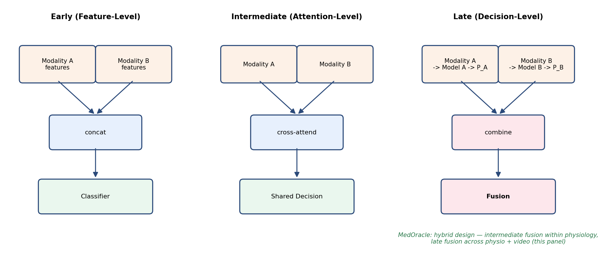

# Chapter 2

## Literature Review

### 2.1 Introduction

This chapter reviews prior work relevant to MedOracle's three constituent problems: physiological (EEG/GSR) emotion recognition, facial video emotion recognition, and multimodal fusion with explainability. Each area is reviewed with attention to datasets, feature representations, classification approaches, and the challenges specific to that modality — particularly, for the physiological literature, the distinction between subject-dependent and subject-independent evaluation, which this project's own results (Chapter 7) show to be far from a minor methodological footnote.

The review is structured to mirror the system's architecture: Section 2.2 covers the physiological branch; Section 2.3 covers the video branch; Section 2.4 covers multimodal fusion strategies and positions MedOracle's hybrid design within the fusion taxonomy; Section 2.5 covers explainability methods; and Section 2.6 synthesises the research gaps that the project's design directly responds to. All citations use the fixed reference list established in Chapter 1 ([1]–[13]); no additional sources are introduced here so that citation numbering remains stable across the full report.

### 2.2 Physiological (EEG/GSR) Emotion Recognition

#### 2.2.1 Datasets for Physiological Emotion Recognition

The DEAP dataset [6] is one of the most widely used benchmarks for physiological emotion recognition. It provides 32-channel EEG (sampled at 128Hz in its preprocessed release) together with peripheral physiological signals, including GSR, recorded from 32 subjects while each watched 40 one-minute music videos selected to elicit a range of emotional responses. After each video, subjects self-reported their valence, arousal, dominance and liking on a continuous 1–9 scale, rather than selecting from a fixed set of discrete emotion labels — a design choice that gives researchers flexibility in defining their own discrete taxonomy, but also means that any discrete mapping (including the one this project uses, described in Chapter 5) is itself a modelling decision with direct consequences for class balance, as this project's own results demonstrate. DEAP's continuous, dimensional (valence/arousal/dominance) annotation is representative of a broader pattern in the physiological emotion-recognition literature, where dimensional models of affect are often preferred over discrete categorical labels precisely because self-reported discrete emotion categories are harder for participants to annotate consistently than a continuous rating scale.

Table 2.1, presented in Section 2.3.1 after both datasets have been introduced, summarises the two primary datasets used across this project, contrasting DEAP's physiological recording protocol against CREMA-D's video recording protocol. The two datasets share no common subjects, which is precisely the constraint (Section 2.4) that this project's cross-dataset fusion evaluation methodology is designed to work around.

#### 2.2.2 Feature Extraction and Signal Processing

Early work on physiological emotion recognition relied on hand-crafted features computed from the raw signal: time-domain statistics (mean, variance, zero-crossing rate), frequency-domain band power computed via Fourier or Welch power spectral density estimation across the standard EEG bands (delta, theta, alpha, beta, gamma), and simple GSR descriptors such as the number and amplitude of skin-conductance-response peaks. Differential Entropy (DE), a log-transform of band power, has become a de facto standard feature for EEG emotion recognition because the log transform makes the otherwise heavy-tailed band-power distribution closer to Gaussian, which in turn makes it considerably easier for a downstream classifier to separate — a property this project verified directly (Section 7.2) by comparing raw band power, DE, and the raw time-domain signal itself under an identical evaluation protocol.

More recent work has moved toward learned feature representations: convolutional architectures inspired by EEGNet apply small, channel-wise temporal filters directly to the raw signal, allowing the network to learn its own frequency-selective filters rather than relying on a fixed Fourier or wavelet decomposition chosen in advance. This is the approach this project's own physiological encoder (Chapter 6) takes for its EEG branch, using a depthwise-separable convolutional stack, before Member 1's bidirectional cross-modal attention layer combines the resulting EEG representation with an analogously encoded GSR representation.

#### 2.2.3 Classification Approaches

Classical classifiers — Support Vector Machines, Random Forests, and Multi-Layer Perceptrons trained on hand-crafted spectral features — remain common baselines in the physiological emotion-recognition literature and were implemented as such in this project (Section 6.2.4) specifically to establish whether a given evaluation result reflects a limitation of the neural architecture or of the underlying data. Deep learning approaches for EEG emotion recognition have layered convolutional feature extraction with recurrent (LSTM [5]) or attention-based temporal modelling to capture the evolution of the signal over a trial window, and, closer to this project's own architecture, some approaches use cross-modal attention specifically to let one physiological signal inform the interpretation of another rather than combining them only at a late, decision-level stage.

Siddharth et al. [12] combined EEG with peripheral physiological signals (including GSR) on the DEAP dataset and reported approximately 73% classification accuracy — a figure that, as discussed further in Section 2.2.4 and revisited in this project's own comparison with related work (Section 7.6), is understood in this report to reflect a within-subject or near-within-subject evaluation protocol common in this literature, rather than the harder subject-independent setting this project adopts for its own headline evaluation.

#### 2.2.4 Challenges: Cross-Subject Generalisation and Class Imbalance

Two challenges recur throughout the physiological emotion-recognition literature and were found, in this project's own experiments, to be decisive rather than incidental. The first is cross-subject generalisation: a model trained on a group of subjects frequently fails to transfer its performance to a new, previously unseen subject, because the electrophysiological signature of a given emotion varies considerably between individuals — in contrast to facial expression, which is comparatively more consistent across people (Section 2.3). This is most rigorously exposed by Leave-One-Subject-Out (LOSO) cross-validation, in which every fold tests on a subject entirely absent from training; LOSO evaluations of fine-grained (four- or five-class) discrete emotion recognition are reported far less often in the literature than within-subject or coarser-grained (binary valence/arousal) evaluations, and, where they are reported, generally show substantially lower performance — a pattern this project's own results in Section 7.2 corroborate directly.

The second challenge is class imbalance arising from the mapping of a continuous, dimensional rating scale onto a discrete taxonomy: because the choice of thresholds on valence, arousal and dominance is itself a modelling decision, a poorly-balanced choice of thresholds can leave some discrete emotion classes represented by only a handful of examples across an entire dataset, an effect this project measured directly and traced as a primary cause of its physiological module's evaluation result (Section 7.2).

### 2.3 Facial Video Emotion Recognition

#### 2.3.1 Datasets for Facial Video Emotion Recognition

The CREMA-D dataset [2] comprises over 7,000 audio-visual clips from 91 actors spanning a range of ages and ethnic backgrounds, each portraying one of six emotions (anger, disgust, fear, happiness, neutral, sadness) at varying levels of intensity, with each clip additionally rated by multiple independent human evaluators for the perceived emotion. This crowd-sourced multi-rater annotation, combined with its actor diversity, makes CREMA-D well suited to training models intended to generalise across previously unseen individuals, and is the dataset used for this project's video-based recognition module. RAVDESS, a comparable but smaller audio-visual dataset recorded from 24 professional actors under more controlled studio conditions, was used during this project's model-development phase alongside CREMA-D to increase training diversity, as described in Chapter 6.

**Table 2.1: Comparison of the DEAP and CREMA-D datasets**

| Property | DEAP | CREMA-D |
|---|---|---|
| Modality | EEG (32 ch, 128Hz) + GSR (peripheral) | Facial video (~30fps) |
| Subjects/Actors | 32 subjects | 91 actors |
| Stimuli | 40 one-minute music videos per subject | ~7,000 short emotionally-labelled clips |
| Labels | Continuous valence/arousal/dominance (1–9) | Discrete: anger, disgust, fear, happy, neutral, sad |
| Annotation | Self-reported by the subject | Crowd-sourced, multiple raters per clip |
| Overlap with the other dataset | None — no shared subjects | None — no shared subjects |

#### 2.3.2 Preprocessing and Face Detection

A face-detection front end is standard practice ahead of the recognition network itself, isolating the face region from background and reducing the input's variability due to camera framing. YOLO-family detectors are increasingly used for this purpose because of their speed and robustness across lighting conditions and pose. Detected faces are conventionally cropped and resized to a fixed input resolution before being passed to the recognition network; this project's own development process, however, found that cropping to the detected face region measurably reduced recognition accuracy relative to resizing the full, uncropped frame (Section 6.3.1), an empirical finding that runs against the more common assumption that cropping is strictly beneficial, and which led this project to repurpose its face-detection pass as a signal-quality assessment tool (Section 5.4) rather than a cropping step.

#### 2.3.3 Feature Extraction and Temporal Modelling

Convolutional architectures — ResNet variants [4] in particular — are the dominant choice for extracting per-frame spatial features in video-based facial emotion recognition, typically initialised from weights pretrained on a large image classification dataset and then fine-tuned, fully or partially, on the target emotion dataset. Because a facial expression evolves over the duration of a clip rather than being fully captured by any single frame, a temporal model — most commonly a Long Short-Term Memory network [5] or its bidirectional variant — is applied over the sequence of per-frame features to capture how the expression develops, rather than aggregating frame-level predictions independently. This convolutional-encoder-plus-recurrent-temporal-model combination is the architecture this project's own video module adopts (Chapter 6), using a partially fine-tuned ResNet50 encoder followed by a two-layer bidirectional LSTM.

Zhang et al. [13] reported approximately 65% accuracy for video-only emotion recognition on a comparable set of classes, a figure broadly consistent with this project's own video module's held-out performance (Section 7.3), and used in Section 7.6 as a point of comparison for this project's own results.

#### 2.3.4 Challenges in Video-Based Emotion Recognition

Video-based facial emotion recognition faces its own distinct challenges: variation in pose and lighting, partial occlusion of the face, and the risk of a temporal model overfitting to actor-specific visual characteristics — a person's facial structure or mannerisms — rather than learning genuinely emotion-relevant patterns, if training and evaluation are not conducted with an actor-independent split. This last risk was encountered directly during this project's own model development (Section 6.3.1), where an early, more heavily fine-tuned configuration of the video model showed a large gap between training and validation performance indicative of exactly this kind of overfitting, and was resolved through a combination of discriminative learning rates and actor-independent cross-validation.

### 2.4 Multimodal Fusion Approaches

#### 2.4.1 Fusion Taxonomy

Multimodal affective-computing surveys [1, 10] distinguish three broad fusion strategies, illustrated schematically in Figure 2.1. Early (feature-level) fusion concatenates raw or lightly-processed features from each modality before a single classifier is trained over the combined representation; this requires the modalities to be temporally aligned and is disrupted if one modality is missing at inference time. Intermediate (attention-level) fusion allows representations from different modalities to interact within the network — for example, through cross-modal attention — before a shared decision is reached; Member 1's bidirectional cross-modal attention between EEG and GSR (Section 2.2.2) is an example of this style of fusion applied within a single modality family. Late (decision-level) fusion, by contrast, trains each modality's model independently and combines only their final output distributions, typically via weighted averaging. Late fusion is generally preferred when modalities have different temporal resolutions, different noise characteristics, and — as is the case for this project — come from datasets with no shared subjects, since DEAP and CREMA-D share no overlapping individuals and joint end-to-end training is therefore not possible without a shared subject pool [1, 10]. This project's system is consequently hybrid: intermediate (attention-based) fusion within the physiological branch, and late fusion across the physiological and video branches, combined via the gated fusion mechanism described in Chapter 5.

**Figure 2.1: Fusion taxonomy — early, intermediate and late fusion**

#### 2.4.2 Confidence- and Quality-Aware Fusion

Static or learned-but-fixed late-fusion weights are common in the literature, but adaptive, confidence-driven weighting — in which the contribution of each modality is adjusted at inference time according to how reliable that modality's prediction currently appears to be — is less common, despite direct motivation from the calibration literature. Guo et al. [3] showed that modern neural networks are frequently poorly calibrated when judged by their raw softmax output, but that an entropy-based confidence measure computed over the full output distribution remains a useful, model-agnostic signal of prediction reliability even when the raw softmax values themselves are not directly trustworthy as probabilities — the basis of this project's own confidence term (Chapter 5). Separately, signal-quality-aware weighting, in which a modality's fusion weight is penalised according to an independently measured quality metric (blur, missing data, artefact) rather than the model's own confidence, has precedent in the image-quality literature: the Laplacian-variance sharpness metric this project uses for video-quality grading (Chapter 5) originates with Pech-Pacheco et al. [9]. This project's gated fusion design combines both signals — entropy-based confidence and an independently measured quality grade — multiplicatively, on the basis that a modality can be quality-degraded without necessarily producing an obviously low-confidence output, and vice versa, so relying on either signal alone would leave a gap the other is needed to close.

**Table 2.2: Summary of related multimodal emotion-recognition approaches**

| Approach | Fusion level | Subject-independent evaluation | Adapts to per-input signal quality |
|---|---|---|---|
| Early/feature-level fusion (general survey pattern [1, 10]) | Early | Not typically emphasised | No |
| Static-weight late fusion (general survey pattern [1, 10]) | Late | Not typically emphasised | No |
| EEG + peripheral physiological signals [12] | Early/feature-level | Not the primary reported protocol | No |
| Video-only recognition [13] | Single-modality | Partially | N/A |
| MedOracle (this project) | Hybrid: intermediate (within physiology) + late (across modalities), confidence- and quality-gated | Yes (physiological module evaluated under LOSO; video module under actor-independent cross-validation) | Yes |

### 2.5 Explainable AI for Emotion Recognition

Explainability has become a practical requirement in affective-computing systems intended for mental-health-adjacent or clinician-facing use, not merely an optional visualisation layer. Survey literature on multimodal machine learning [1] emphasises that systems operating on heterogeneous, noisy sensor streams must justify their outputs if they are to be trusted outside a controlled laboratory setting; similarly, reviews of affective computing [10] note that emotion-recognition models are frequently deployed as black boxes even though their predictions can influence downstream decisions about a person's state. This section reviews how post-hoc attribution methods address that gap, why multimodal fusion introduces explainability challenges that unimodal systems do not face, and how faithfulness evaluation and trust-aware conflict explanation extend the literature beyond reporting a single predicted label.

#### 2.5.1 Motivation: Why Explanations Matter in Emotion Recognition

A classification output alone — for example, a label of "stress" with an associated probability — answers *what* the system predicted but not *why*, *how confident the system is in each input channel*, or *what a user should do with the result*. In mental-health-adjacent contexts, these questions are not secondary. Self-report instruments suffer from recall and desirability bias (Section 1.2); an automated system that replaces self-report without explaining its reasoning merely shifts opacity from the user to the model. Explainability is therefore motivated by three concrete requirements that this project's design treats as first-class: **transparency** (surfacing which modality and features influenced the decision), **reliability qualification** (communicating when an input channel was degraded or missing), and **auditability** (allowing a clinician or researcher to inspect whether the system's reasoning is consistent with the prediction).

Prior unimodal work in physiological emotion recognition [12] and video-based recognition [13] typically reports accuracy or F1 score without accompanying per-instance explanations, global feature-importance rankings alone, or any account of how a fused decision would be justified when modalities disagree. MedOracle's explainability layer (Member 3, Chapters 4 and 6) is designed specifically to close that gap for a *fused*, quality-gated prediction rather than for either branch in isolation.

#### 2.5.2 Post-Hoc Attribution Methods and SHAP

Post-hoc explainability methods treat the trained model as a black box and estimate, for each prediction, how much each input feature contributed to the output relative to a defined baseline. This contrasts with inherently interpretable models (linear models with explicit coefficients, decision trees with readable rules), which are often too restrictive for the deep architectures used in EEG and video emotion recognition [4, 5, 12, 13]. Among post-hoc methods, gradient-based saliency maps, layer-wise relevance propagation, and perturbation-based approaches each trade off fidelity to the model, computational cost, and human interpretability differently.

SHAP (SHapley Additive exPlanations) provides a model-agnostic, game-theoretically grounded attribution framework grounded in Shapley values from cooperative game theory: each input feature (or feature group) is treated as a "player" in a coalition game, and its attribution is the average marginal contribution it makes across all possible feature subsets, relative to a background reference distribution. Kernel SHAP approximates this attribution for arbitrary black-box predictors by sampling or enumerating feature coalitions and fitting a weighted linear model over perturbation results. The appeal of SHAP in sensitive application domains — including healthcare-adjacent settings — is that it produces a **signed, per-instance, per-feature attribution** that sums to the difference between the model output and the baseline expectation, rather than only a global ranking computed once over an entire dataset. That property makes it suitable for answering "why this prediction, for this person, on this trial?" rather than "which features matter on average across the training set?"

#### 2.5.3 Explainability in Multimodal and Late-Fusion Settings

Applying SHAP in a multimodal system is not a straightforward transfer of unimodal practice. Three complications, all directly relevant to MedOracle's architecture, distinguish the multimodal case.

**First**, late fusion (Section 2.4.1) means the explainability layer often receives only the final `prediction_output` dictionary — fused probabilities, per-modality predictions, modality weights, and signal-quality grades — rather than access to the internal activations of Member 1's EEG/GSR network or Member 2's ResNet50/BiLSTM stack. A model-agnostic explainer that operates on the fusion boundary is therefore an architectural necessity when three modules are developed independently and communicate through shared interface contracts [1, 10], not merely a convenience.

**Second**, the natural unit of explanation in a late-fusion system is frequently the **modality** (physiological vs video) rather than individual EEG channels or video pixels, because the fusion mechanism combines modality-level probability vectors. MedOracle's Kernel SHAP implementation treats physiological and video branches as two primary players in a coalition game with four subsets (neither, physio-only, video-only, both), for which the two-player Shapley value admits an exact closed-form solution without Monte Carlo sampling. The physiological Shapley contribution is further decomposed into separate EEG and GSR attributions using quality-weighted splitting, reflecting the fact that Member 1's model processes both signals jointly rather than as independent fusion inputs.

**Third**, explanation must remain coherent under **graceful degradation**: when video is missing or graded "poor", the fusion weights and the meaningful feature set change. An explanation layer that assumes both modalities are always present would produce misleading attributions in exactly the deployment conditions (degraded camera, loose electrode) that quality-aware fusion is designed to handle (Section 5.6). MedOracle's explainability pipeline therefore consumes the same `prediction_output` schema whether zero, one, or two modalities contributed to the fused label, matching the downstream contract Member 3's web application expects.

#### 2.5.4 Faithfulness Evaluation of Explanations

A recurring limitation of post-hoc explainability is that an attribution can appear plausible to a human reader while failing to reflect the model's actual decision logic — a distinction often described in the literature as the gap between **plausibility** and **faithfulness**. Plausible explanations use familiar feature names and reasonable narratives; faithful explanations change predictably when the inputs that supposedly drove the decision are perturbed or removed.

Faithfulness evaluation addresses this by **masking or ablating** input features (or modality-level inputs) and measuring whether the model output changes in the direction and magnitude the explanation predicts. A common protocol ranks features by absolute attribution, progressively replaces top-ranked features with a background baseline, and correlates the rank order of attributions with the rank order of resulting confidence drops. A high correlation indicates that the features SHAP identified as important are indeed those whose removal most reduces the model's confidence in the predicted class — a quantitative check that the explanation tracks the prediction rather than merely describing it.

MedOracle implements this principle over the fused prediction: SHAP attributions for EEG, GSR, and video are accompanied by a faithfulness score computed by progressive modality masking and correlation against confidence change (Chapter 6). Reliability flags derived from the `signal_quality` fields further qualify whether an explanation should be treated as trustworthy given degraded input, connecting explainability to the same quality tiers that drive fusion (Section 5.4) rather than treating explanation as independent of input reliability.

#### 2.5.5 Modality-Conflict and Trust-Aware Explanation

Multimodal fusion introduces a failure mode that unimodal explainability never encounters: **modality conflict**, where the physiological branch and the video branch predict different emotion classes for the same trial. A fused system must not only resolve that conflict (via gated weighting) but also explain *how* it was resolved — which modality was trusted, whether trust was driven by entropy-based confidence [3] or by signal-quality penalties [9], and whether the fused label agrees with one branch, the other, or neither.

Survey patterns in multimodal affective computing [1, 10] describe fusion strategies in detail but rarely expose the internal trust reasoning at inference time. Siddharth et al. [12] and Zhang et al. [13] report classification performance for physiological and video modalities respectively without surfacing per-modality disagreement or quality-aware trust decomposition. MedOracle's modality-conflict explanation module addresses this by re-deriving the full gate trace from the `prediction_output` — confidence scores, quality penalty factors (α), gate scores, and L1-normalised weights — and presenting a structured account of which factor decided the outcome. It additionally supports **counterfactual queries** over signal quality (for example, whether the fused label would change if a degraded EEG reading had been graded "good"), making the quality-gating mechanism inspectable rather than opaque.

This trust-aware conflict explanation is complementary to SHAP attribution rather than redundant: SHAP answers which modality contributed most to the winning-class probability under a Shapley framework; the conflict explainer answers why two modalities disagreed and which calibration or quality signal the fusion rule used to break the tie.

#### 2.5.6 From Feature Attribution to User-Facing Natural-Language Explanation

Raw SHAP values and gate traces are informative to a developer but insufficient for a non-technical end user trying to understand their emotional patterns over time. A further layer is therefore required to translate structured attribution data into plain language. Large language models (LLMs) can perform this translation, but unconstrained prompting risks **hallucinated mechanisms** — plausible-sounding explanations not grounded in the system's actual numbers.

MedOracle's chatbot pipeline (Chapter 6) addresses this by constraining generation: the prompt includes the structured conflict numbers (per-modality predictions, fusion weights, signal-quality grades, counterfactual outcomes) together with retrieved facts from a curated knowledge base, and the generated text is scored against the underlying mathematics before being returned. If the explanation fails a faithfulness threshold, the system regenerates with corrective feedback or falls back to a template rationale that is guaranteed consistent with the gate trace. This closed-loop design treats natural-language explanation as a **verified output** rather than an uncontrolled narrative, though its clinical usefulness to end users remains an open question pending formal user study (Section 7.7).

The web application surfaces these explanations through an emotion-trend chart, a SHAP bar chart, a session-history panel, and the modality-conflict explanation panel described above — each rendering the same underlying `shap_output` dictionary so that visual and textual explanations remain consistent regardless of whether the user invoked video-only or full multimodal prediction.

#### 2.5.7 Challenges in Explainable Multimodal Emotion Recognition

Several challenges remain open in this area and constrain how strongly explainability claims can be stated. **Explanation under weak modalities**: when the physiological branch performs near chance under LOSO (Section 7.2), SHAP can faithfully attribute a fused prediction to the video modality, but the overall system may still be unsuitable for physiology-driven conclusions — explainability clarifies the reasoning without correcting poor unimodal accuracy. **Faithfulness is necessary but not sufficient**: a high faithfulness score validates that attributions track perturbation behaviour; it does not establish that users understand or act appropriately on the explanation. **LLM-generated text requires ongoing verification**: even with grounding and retry logic, template fallback rates and hallucination metrics should be monitored in deployment. **Regulatory and ethical framing**: explainability supports transparency but does not, on its own, satisfy clinical safety or fairness requirements — a point this project acknowledges by scoping the system as a research prototype (Section 1.3.1).

**Table 2.3: Comparison of explainability support in related emotion-recognition approaches**

| Approach | Per-instance attribution | Multimodal-aware | Faithfulness metric | Conflict / trust explanation | User-facing NL explanation |
|---|---|---|---|---|---|
| Physiological DEAP work [12] | Not typically reported | N/A (single modality) | No | N/A | No |
| Video recognition [13] | Not typically reported | N/A (single modality) | No | N/A | No |
| General multimodal surveys [1, 10] | Discussed as desideratum | Fusion-level discussed | Not standardised | Not emphasised | Not emphasised |
| MedOracle (this project) | Yes (Kernel SHAP: EEG, GSR, video) | Yes (late-fusion coalition) | Yes (perturbation correlation) | Yes (gate trace + counterfactuals) | Yes (grounded LLM + template fallback) |

Table 2.3 summarises the explainability gap MedOracle targets relative to the unimodal baselines and general survey patterns cited elsewhere in this chapter. The next section synthesises this gap together with the fusion and evaluation gaps reviewed in Sections 2.2–2.4 into the project's overall research positioning.

### 2.6 Research Gap and Positioning

Synthesising the literature reviewed above, four gaps motivate MedOracle's specific design choices and map directly to the research questions stated in Section 1.4.3:

**Gap 1 — Static fusion under real-world input variability.** Survey literature [1, 10] documents extensive multimodal fusion work, but most reported systems assume all modalities are present and combine them with fixed or learned-but-static weights that do not adapt when a sensor is degraded or absent. MedOracle's gated fusion (Section 5.6) addresses RQ2 by combining entropy-based confidence [3] with independently measured signal quality [9] at every prediction.

**Gap 2 — Subject-independent evaluation of physiological emotion recognition.** High accuracy figures on DEAP [6] and comparable datasets [12] are frequently obtained under within-subject or random-split protocols that allow subject leakage; honest LOSO evaluation of fine-grained discrete emotion recognition is reported far less often and typically yields substantially lower performance. MedOracle addresses RQ3 by adopting LOSO as its headline physiological protocol and diagnosing the resulting limitation rather than concealing it (Section 7.2).

**Gap 3 — Cross-dataset multimodal evaluation.** When no single public dataset provides every modality from the same subjects — as is the case for DEAP and CREMA-D [2] — joint training and naïve hold-out evaluation are architecturally impossible. Late fusion with a principled cross-dataset pairing methodology [1, 10] is the standard response; MedOracle implements this explicitly for both the ablation study and the web-application demonstration set (Section 6.3.4), addressing RQ1.

**Gap 4 — Explainability beyond a single label.** Prior work on video [13] and physiological [12] emotion recognition typically reports classification accuracy without surfacing which modality drove a fused decision, how reliable each input was judged to be, or how modality disagreement was resolved. General multimodal surveys [1, 10] discuss explainability as a desideratum but do not standardise faithfulness evaluation or trust-aware conflict explanation at the fusion boundary. MedOracle addresses RQ4 through Kernel SHAP attribution over EEG, GSR, and video; perturbation-based faithfulness scoring; gate-trace conflict explanation with quality counterfactuals; and a web application that renders these outputs alongside grounded natural-language summaries (Sections 2.5 and 6.4).

Table 2.2 situates MedOracle against the fusion and evaluation gaps; Table 2.3 extends that comparison to explainability. Taken together, MedOracle is, within the cited literature, the only approach in these comparisons that simultaneously adopts subject-independent unimodal evaluation, quality- and confidence-aware late fusion, and post-hoc multimodal explainability with faithfulness verification and conflict explanation.

### 2.7 Summary

This chapter reviewed the datasets, feature representations, classification approaches, fusion strategies, and explainability methods relevant to physiological, video-based and multimodal emotion recognition. Three recurring themes proved directly consequential to this project's design: the gap between within-subject and subject-independent evaluation of physiological emotion recognition; the relative scarcity of fusion mechanisms that adapt to per-input signal quality rather than relying on fixed or purely confidence-based weighting; and the absence, in much of the cited unimodal and survey literature, of per-instance multimodal attribution with faithfulness verification and trust-aware conflict explanation. Section 2.6 mapped these themes to explicit research gaps that MedOracle's design addresses. The next chapter describes the technologies adopted to implement the system that this project's design responds to these findings with.
